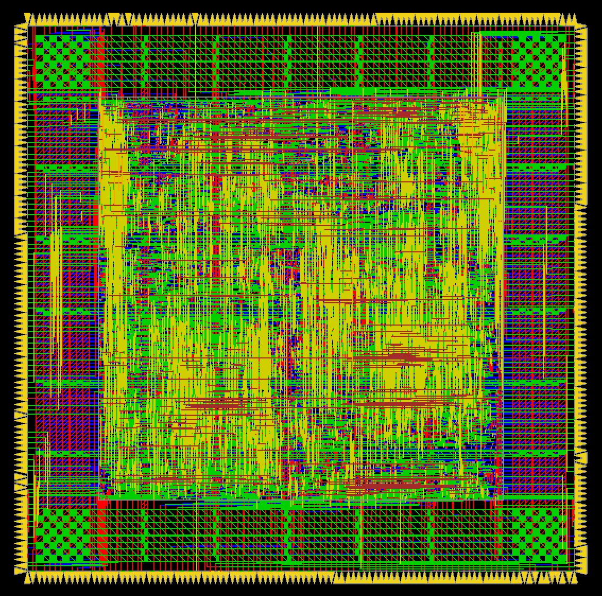

## Final Project 注意事項
今年FP的題目和MP相比只多了一個比大小的mode而已，非常簡單，MP的控制架構如果寫得比較靈活的話大概一小時內就可以完成RTL的部分了  
另外，FP要做APR，助教有給腳本可以直接照著run，如果timing沒甚麼問題的話，大概半小時內就可以完成APR了  
如果CT低於3.0左右的話，因為reg2out的launch edge的clk是經過clock tree delay過的，但輸出得capture edge卻是沒有經過clock tree delay的clk，所以在APR的時候輸出會過於嚴格，輸入會過於寬鬆  
這邊有幾種可能的解法
- 1. 做CDC，讓輸出的clk domain慢一點，中間運算的部分用較快的clk  
- 2. 在輸出端設multicycle path(但之前我只有看過reg2reg，不確定這是否有支援reg2out)
- 3. 讓ccopt長unbalanced tree，讓驅動output reg的clk tree淺一點
- 4. 用update_io_latency讓STA考慮到IO和clock tree delay的關係
- 5. 直接手動調整Clock Tree的Buffer

---

## Tips (同MP)
- 除法器可以用多個cycle連續做減法來代替，可以讓CT更低，面積也更小
- 做auto focus時儲存中間的6x6的資料可以用shift register，在計算差值的時候也用shift的方式來取值可以減少很多面積
- 由於auto exposure的ratio縮小pixel intensity的case比放大還要多，所以當測資越多的時候，會有越多張圖片變成全0，全0的圖片可以直接輸出0
- 判斷全0的邏輯有兩種方法
  - 1. 檢查寫回DRAM的資料是否為全0 (面積小，latency長，因為沒辦法跳過這次剛好變成全0的運算)
  - 2. 可以用記錄ratio來實現，如果累積左移8以上的話就代表這張圖必定為全0 (面積大，latency短)
- 不管目前輸入是要左哪個mode，都可以同時計算兩種mode的結果然後存起來，如果遇到同一張圖做auto focus的話就可以直接輸出之前紀錄的結果，如果遇到同一張圖做auto expocure並且ratio為1的話就可以直接輸出之前紀錄的結果
- 盡量切pipeline，甚至MUX前後也可以切 (有時候MUX的delay甚至會比減法器還大)

---

## My Perf
- Cycle Time: 2.2
- Latency: 40500
- Cell_Area: 216939.240586
- CHIP_Area: 586678.422
- Perf:  (Cell_Area * Latency^2 * CT)
- Rank: 1

---

## Layout

