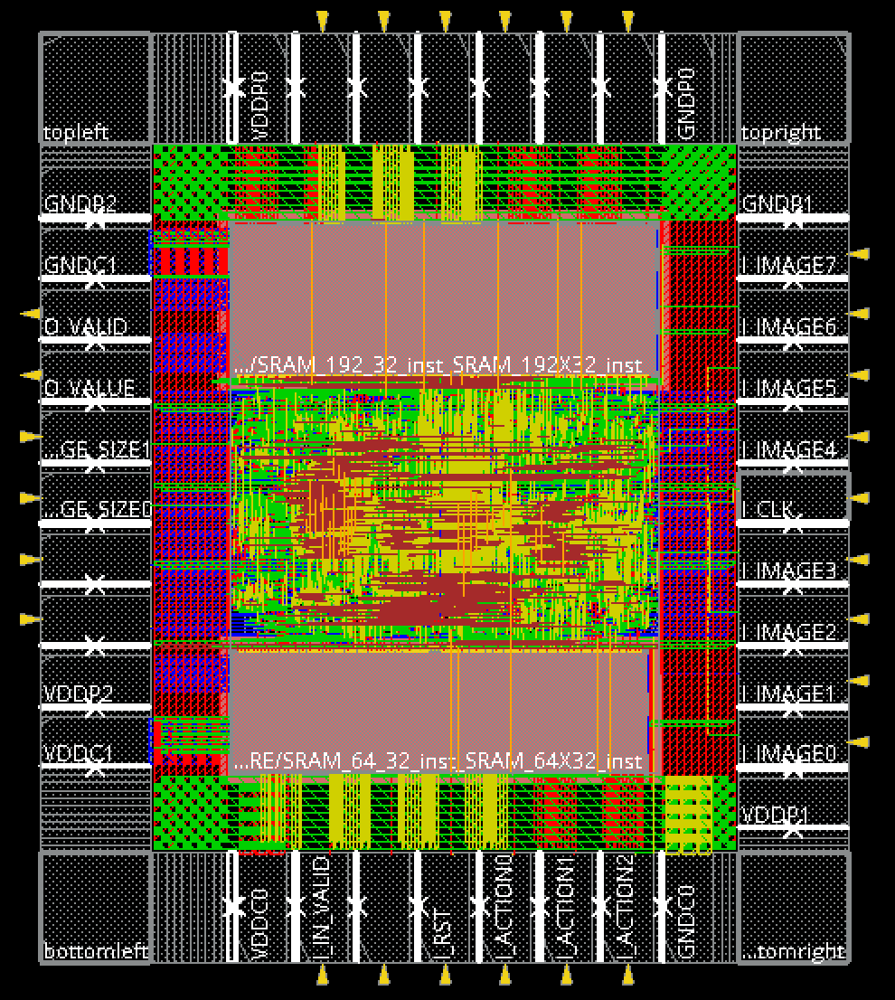

## Lab11 注意事項
這次Lab是拿Lab05的電路來做APR  
如果有時間的話可以重寫design，或是提早先寫完等Lab11來用  

IO PAD到core的IO會有很長的delay(input pad to core input大概是0.9ns，output pad to core output大概是1.9ns)  
這樣加起來就2.8ns了，外加output dealy為0.5個cycle，這樣可以算出critical path delay一定會大於2x2.8=5.6ns，並且會在輸出，  
然後還有clock tree也會有額外的delay，就算輸出已經擋了一層reg，critical path也會是output reg的clk到output pad，  
這段的路徑會是: input pad的clk -> core的clk -> 多級的clock tree delay -> clk to q -> core output -> output pad  
以我的電路來說，input pad to core input為0.9ns，clock tree delay為0.3ns，clk to q為0.5ns，core output to output pad為1.9ns  
所以cycle time的極限為2x(0.915+0.396+0.5+1.94)=7.5ns
就算當初在Lab05的時候跑02合的到4ns以下，在APR的時候會被強制拉高到7.5ns以上，所以當時的pipeline其實就算是白切了 : )  

然後記得04_MEM資料夾要把Exercise中規定的**所有**的Memory的檔案都放進去(包含WC.lib, **BC.lib**以及其他相關的檔案)  
雖然05_APR中也需要放那些lib和lef檔，但04_MEM也一定要放，因為助教說link APR裡LIB資料夾的檔案會broken，所以才一定要放到04_MEM中  
我就是以為他能夠直接link 05_APR裡面的檔案然後04_MEM就少放BC.lib，然後就直接2de了 = =

---

## Tips
- CORE POWER PAD和IO POWER PAD不用放太多，不然會把整個CHIP的面積撐到超大
- floorplan後的步驟都可以用腳本來跑會快很多，但要注意助教給的腳本的參數通常會有SPEC規定的不同，要記得自己修改，並且在腳本中可以多放幾次ECO
- nano route的iteration建議直接調到100以上
- 遇到timing violation的時候直接ECO三次，如果都沒改善的話有三條路: 1. 回到floorplan重擺SRAM或改core utilization 2. 改CHIP.io中PAD擺放的位置(這個影響比較小) 3. 用更長的cycle time(要重跑02)
- SRAM盡量靠邊，然後把IO pin轉像CHIP內部
- 最後加上FILLER後要重新跑DRC、LVS、post-route setup time analysis、post-route hold time analysis
- 可以將09_submit的tar檔傳給朋友讓他在他的環境下跑看看來模擬助教demo的情況，看是否有缺少某些.lib .lef之類的檔案

---

## My Perf
- Cycle Time: 7.8
- Latency: 93755
- cell_Area: 306551.3779
- CHIP_Area: 1213870.552
- Perf: 1.07754E+18 (CHIP_Area^2 * Latency * CT)
- Rank: 2

---

## Layout

